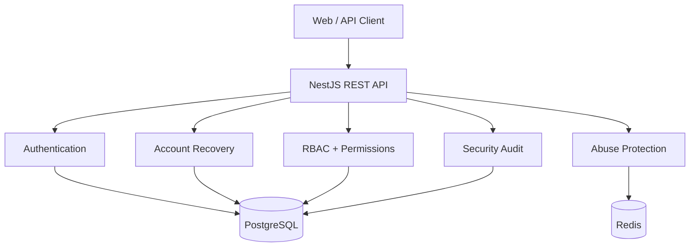
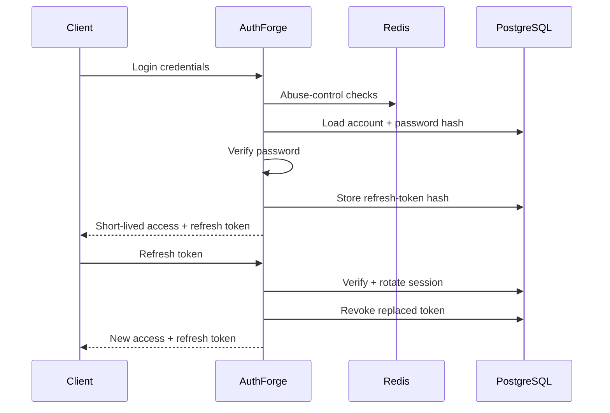

# AuthForge

  <strong>Security-first authentication and authorization infrastructure for modern applications.</strong> 
  A production-oriented NestJS backend built around secure identity, token lifecycle, authorization, and abuse controls.

  
  
  
  
  
  

---

## Why AuthForge?

Authentication looks simple until the edge cases matter.

AuthForge is a security-focused backend project designed to demonstrate how authentication and authorization controls can be designed, implemented, tested, and deployed as one coherent system.

It focuses on the boundaries that are easy to get subtly wrong:

- Password storage and verification
- JWT validation and current identity
- Refresh-token rotation and replay detection
- Session lifecycle and revocation
- Account verification and password recovery
- Server-side RBAC and permissions
- Brute-force and abuse protection
- Security audit trails

> **Core principle:** security behavior belongs in the backend, should be enforced by tests, and should be explainable from the architecture.

## Architecture

### Authentication flow

## Security model

| Area | Implementation |
| --- | --- |
| Passwords | Node.js `scrypt` with a unique random salt per password |
| Access tokens | Short-lived JWTs with a 15-minute lifetime |
| JWT validation | HS256, issuer and audience restrictions, plus fresh DB identity validation |
| Refresh tokens | Opaque random tokens; only SHA-256 hashes are persisted |
| Refresh rotation | One-time rotation with token-family replay detection |
| Sessions | Active-session listing, ownership-scoped revocation, and logout-all |
| Authorization | Server-side RBAC with fine-grained permissions |
| Abuse protection | Redis-backed login and refresh controls plus route throttling |
| Audit | Security events with request context; no raw credentials or tokens |
| Recovery tokens | 256-bit opaque tokens, hashed at rest, expiring and single-use |

## What is implemented?

### Authentication

- Secure registration and password hashing
- Login with unknown-user timing mitigation
- Strict JWT algorithm, issuer, and audience verification
- Fresh database identity validation on protected requests
- Short-lived access tokens
- Refresh-token rotation
- Refresh-token replay detection
- Token-family revocation

### Account lifecycle

- Email verification token lifecycle
- Password reset token lifecycle
- Generic recovery responses to reduce account enumeration
- Hashed recovery-token storage
- Single-use and expiry enforcement
- Session revocation after password reset

### Sessions & authorization

- Active session listing
- Ownership-scoped session revocation
- Logout-all
- Server-side RBAC
- Fine-grained permissions
- Permission bypass regression tests

### Abuse protection & observability

- Redis-backed login and refresh abuse controls
- Route-specific request throttling
- Authentication audit events
- Request context attached to security events
- No passwords or raw tokens written to audit logs

## Security testing

Security tests are part of the implementation rather than a final checklist.

Current regression coverage includes:

- Authentication failures and account-enumeration resistance
- Password hashing and constant-time password comparison
- Refresh-token replay
- Concurrent refresh races
- Token-family revocation
- Cross-user session isolation
- Permission bypass attempts
- JWT identity enforcement
- Recovery-token expiry and single-use behavior
- Session revocation after password reset

## Technology stack

| Layer | Technology |
| --- | --- |
| Backend | TypeScript, NestJS 11 |
| Database | PostgreSQL, Prisma ORM |
| Security state | Redis 7 |
| Authentication | JWT + opaque refresh tokens |
| Password hashing | Node.js `scrypt` |
| Validation | class-validator |
| API documentation | Swagger / OpenAPI |
| Testing | Jest |
| Deployment | Docker + GitHub Actions |
| Demo interface | GitHub Pages |

## Deployment status

### 🟢 Hosted backend verified

AuthForge has completed its first hosted deployment on a Docker-based hosting environment.

The hosted deployment has been verified through a live health check returning the expected service status. PostgreSQL connectivity and Prisma migration execution were also verified during deployment.

### 🟡 Still being built

- Production email delivery integration
- Full hosted end-to-end recovery flows
- Operational monitoring and alerting
- Public API contract finalization and versioning
- Production client integration

### 🔴 Not production-ready yet

Deployment is **not the same thing as production readiness**. The project still requires additional operational and product controls before it should be treated as a production authentication service, including:

- Production email provider and delivery controls
- Monitoring, alerting, and incident response
- Verified PostgreSQL backup and recovery procedures
- Redis availability and operational guarantees
- Final browser-client token transport/storage strategy
- Production release and operational runbooks

## Documentation

| Document | Purpose |
| --- | --- |
| [`PRODUCT.md`](docs/PRODUCT.md) | Product scope and boundaries |
| [`ARCHITECTURE.md`](docs/ARCHITECTURE.md) | System architecture |
| [`DATABASE.md`](docs/DATABASE.md) | Database design |
| [`API.md`](docs/API.md) | Implemented API endpoints and security rules |
| [`AUTHENTICATION.md`](docs/AUTHENTICATION.md) | Authentication and token lifecycle |
| [`REGISTRATION-SECURITY.md`](docs/REGISTRATION-SECURITY.md) | Registration security decisions |
| [`THREAT-MODEL.md`](docs/THREAT-MODEL.md) | Threats and mitigations |
| [`DECISIONS.md`](docs/DECISIONS.md) | Engineering and security decisions |
| [`ROADMAP.md`](docs/ROADMAP.md) | Build roadmap |
| [`DEPLOYMENT.md`](docs/DEPLOYMENT.md) | Hosted deployment runbook |
| [`PRE-DEPLOYMENT-SECURITY-CHECKLIST.md`](docs/PRE-DEPLOYMENT-SECURITY-CHECKLIST.md) | Production release gates |

## Live demo

**[Open the AuthForge demo](https://sidk31.github.io/authforge/)**

The current GitHub Pages interface is a safe demonstration frontend. It validates input locally and does not send or store credentials. The hosted backend is deployed separately while the production client integration is still being built.

## Engineering approach

AuthForge is intentionally built as a modular monolith rather than a collection of unnecessary services.

The workflow is simple:

**Threat model → implement the control → write the regression test → run CI → deploy → verify → document.**

The goal is not to build another login form. It is to build authentication infrastructure whose security decisions can be inspected and defended.

## License

A license will be selected before the first public release.
