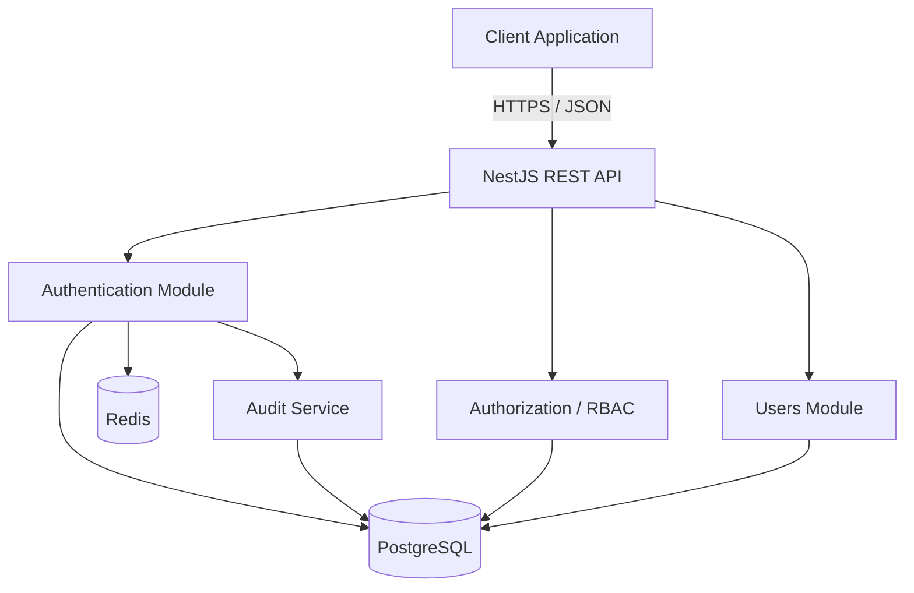
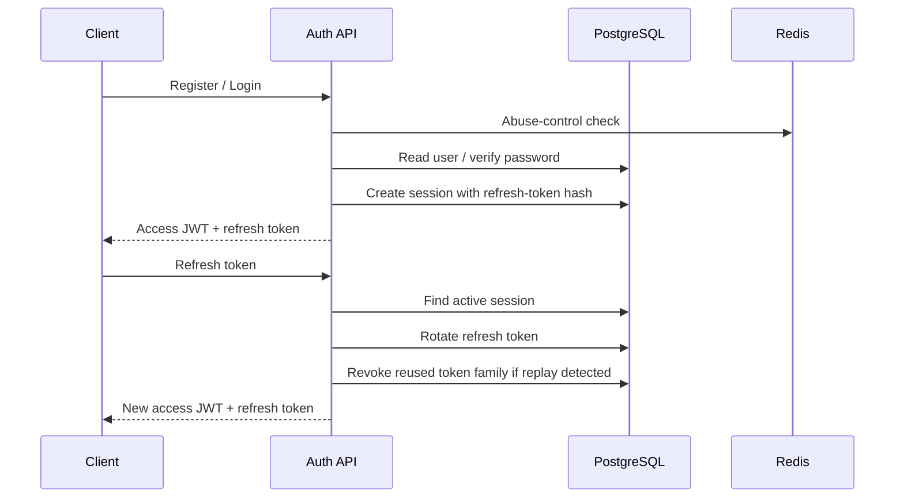

<div align="center">

# AuthForge

### Secure authentication & authorization infrastructure for modern applications

**Production-oriented security engineering • TypeScript • NestJS • PostgreSQL • Redis**

[](https://github.com/SidK31/authforge/actions/workflows/ci.yml)
[](https://sidk31.github.io/authforge/)
[](#license)

<br />

**AuthForge is being built to make authentication security understandable, testable, and reusable.**

[Live Demo](https://sidk31.github.io/authforge/) · [Architecture](docs/ARCHITECTURE.md) · [Threat Model](docs/THREAT-MODEL.md) · [Roadmap](docs/ROADMAP.md)

</div>

---

## ⚡ What is AuthForge?

Authentication is easy to demo and surprisingly easy to get wrong.

AuthForge is a backend-first authentication and authorization platform focused on the security details that usually get skipped: password handling, token lifecycle, refresh-token rotation, session revocation, authorization boundaries, abuse protection, and security audit trails.

The project is intentionally being built as a **modular monolith** rather than starting with unnecessary microservices. The goal is to keep the security model easy to reason about while still using production-oriented engineering practices.

> **Status:** actively under development. Some capabilities are implemented today; others are deliberately marked as planned below.

---

## 🛡️ Security at the center

| Security area | Current direction |
| --- | --- |
| Password storage | Node.js `scrypt` with per-password random salt |
| Login enumeration | Dummy password verification for unknown users |
| Access tokens | Short-lived JWTs with strict issuer/audience/algorithm validation |
| Refresh tokens | Opaque random tokens; only SHA-256 hashes are stored |
| Refresh rotation | Token rotation with token-family reuse detection |
| Sessions | Revocation, logout-all, expiry and session metadata |
| Authorization | Server-side RBAC and permission checks |
| Abuse protection | Redis-backed authentication throttling |
| Auditability | Security events with IP/user-agent context and safe metadata |
| Testing | Security-focused automated regression tests |

---

## 🧩 Architecture



### Authentication flow



The diagrams are intentionally simple: **the important part is the trust boundary and where security state lives.**

---

## 🏗️ Tech Stack

| Layer | Technology | Purpose |
| --- | --- | --- |
| Backend | **NestJS + TypeScript** | Modular REST API and security boundaries |
| Database | **PostgreSQL** | Users, roles, permissions, sessions and audit events |
| ORM | **Prisma** | Type-safe database access and migrations |
| Security state | **Redis** | Authentication abuse controls and short-lived counters |
| Authentication | **JWT + opaque refresh tokens** | Short-lived API access + rotating sessions |
| Password hashing | **Node.js scrypt** | Password storage resistant to offline cracking |
| Testing | **Jest** | Unit and security regression tests |
| API docs | **Swagger / OpenAPI** | Developer-facing API contract |
| Deployment | **Docker + GitHub Actions** | Reproducible builds and CI verification |

---

## 🚦 Project Status

### Foundation

- 🟢 Project structure and product direction
- 🟢 System architecture and threat model
- 🟢 PostgreSQL + Prisma data model
- 🟢 Docker and CI foundation
- 🟢 GitHub Pages demo

### Authentication

- 🟢 Registration
- 🟢 Secure password hashing
- 🟢 Login
- 🟢 JWT access-token validation
- 🟢 Refresh-token rotation
- 🟢 Replay/reuse detection
- 🟢 Session revocation
- 🟢 Logout / logout-all
- 🟡 Password reset
- 🟡 Email verification

### Authorization & Security

- 🟢 Roles and permissions foundation
- 🟢 Server-side permission guard
- 🟢 Privilege-boundary tests
- 🟢 Authentication audit events
- 🟢 Redis-backed authentication abuse controls
- 🟢 Security-focused automated tests
- 🟡 Broader security review and deployment hardening

---

## 🔐 How the token model works

AuthForge separates short-lived API access from long-lived session state.

**Access token**

- JWT
- short-lived
- signed by the server
- validated with an explicit algorithm, issuer and audience
- carries the authenticated subject used by protected routes

**Refresh token**

- cryptographically random and opaque
- never stored in plaintext in PostgreSQL
- represented by a SHA-256 hash in the `Session` table
- rotated after successful refresh
- linked to a token family
- replay of a replaced token can revoke the remaining family

This makes refresh tokens behave like revocable session credentials rather than permanent bearer credentials.

---

## 👮 Authorization model

AuthForge does not treat client-side role information as an authorization decision.

Protected operations use server-side permission checks:

```text
Request
  ↓
JWT authentication
  ↓
Authenticated user
  ↓
User → Roles → Permissions
  ↓
Permission check
  ↓
Controller / operation
```

Example permission:

```text
roles:read
```

A valid JWT alone is **not** enough to access a permission-protected endpoint.

---

## 🧪 Security testing

The test suite is designed to verify security behavior, not only happy-path functionality.

Current coverage includes:

- password hashing and verification
- unknown-user login behavior
- inactive-user handling
- JWT verification constraints
- refresh-token rotation
- refresh-token replay detection
- session revocation
- logout-all behavior
- RBAC permission boundaries
- authentication abuse-control limits
- Redis failure behavior

Every security change is expected to go through:

```text
Issue
  ↓
Implementation
  ↓
Security tests
  ↓
CI
  ↓
Review
```

---

## 📚 Documentation

| Document | What it covers |
| --- | --- |
| [`PRODUCT.md`](docs/PRODUCT.md) | Product scope and goals |
| [`ARCHITECTURE.md`](docs/ARCHITECTURE.md) | System architecture and boundaries |
| [`DATABASE.md`](docs/DATABASE.md) | Database design and relationships |
| [`API.md`](docs/API.md) | API direction and endpoints |
| [`AUTHENTICATION.md`](docs/AUTHENTICATION.md) | Authentication lifecycle |
| [`REGISTRATION-SECURITY.md`](docs/REGISTRATION-SECURITY.md) | Registration security decisions |
| [`THREAT-MODEL.md`](docs/THREAT-MODEL.md) | Threats and mitigations |
| [`DECISIONS.md`](docs/DECISIONS.md) | Important engineering decisions |
| [`ROADMAP.md`](docs/ROADMAP.md) | Implementation roadmap |
| [`ACCOUNT-HEALTH.md`](docs/ACCOUNT-HEALTH.md) | Project/account operational notes |

---

## 🌐 Live demo

The frontend demo is deployed with GitHub Pages:

**https://sidk31.github.io/authforge/**

The current demo is intentionally safe. Registration input is validated locally and credentials are **not sent to or stored by a real backend yet**. The production API connection will be introduced after backend deployment is ready.

---

## 🎯 What comes next

The next major milestones are:

1. Password reset and email verification
2. Fresh identity/session validation
3. Additional authorization management APIs
4. Broader security review and abuse-case testing
5. Production deployment
6. Public API and developer experience hardening
7. First public release

The roadmap is intentionally incremental. AuthForge is being built as a security project that can be **reviewed and trusted step by step**, rather than as a large code dump produced all at once.

---

## 💡 Why build this?

Most applications eventually need authentication. Fewer teams have the time to deeply reason about every security edge case around it.

AuthForge is an engineering project for exploring those edge cases in a concrete system:

**design → implement → attack the assumption → test the failure → harden → document**

The long-term direction is an open-source security-focused authentication core with the option for hosted and enterprise deployments.

---

## ⚠️ Production note

AuthForge is **not yet a production-ready drop-in authentication service**. It is an actively developed engineering project.

Before production use, the deployment will still require environment-specific work around secrets, TLS, trusted proxy configuration, Redis/PostgreSQL availability, monitoring, email delivery, operational alerting, backup/recovery, and a full security review.

Never use the current GitHub Pages demo for real credentials.

---

## 📄 License

A license will be selected before the first public release.

<div align="center">

### Built with security in mind. Tested against assumptions. 🔐

</div>
