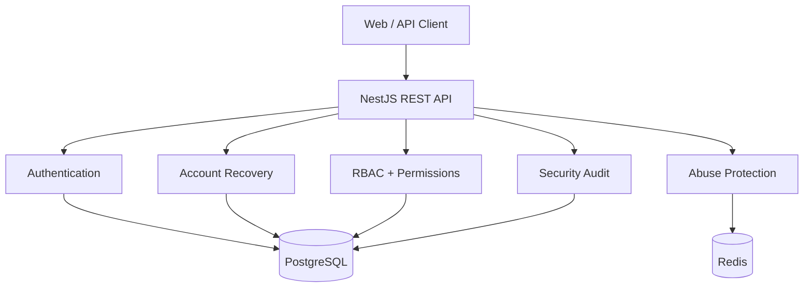
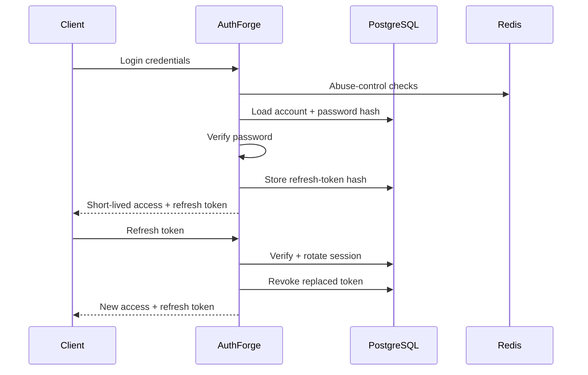
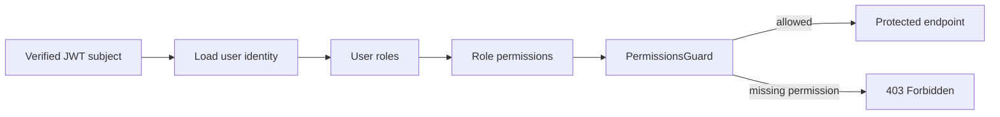

# AuthForge

  <strong>Secure authentication and authorization infrastructure for modern applications.</strong> 
  Built as a security-first NestJS backend with PostgreSQL, Redis and automated security testing.

  
  
  
  
  
  

---

## What is AuthForge?

AuthForge is a production-oriented authentication and authorization platform being built from the security model outward.

The project focuses on the parts that are easy to get subtly wrong: password handling, token lifecycle, refresh-token rotation, account recovery, authorization boundaries, abuse protection and security audit trails.

> **Project principle:** security behavior should be enforced by the backend, observable through tests, and understandable from the architecture.

## Architecture

### Security architecture

## Security model

| Area | Current approach |
| --- | --- |
| Passwords | Node.js `scrypt` with per-password random salt |
| Access tokens | Short-lived JWTs, 15 minutes |
| JWT validation | HS256 + issuer + audience restrictions |
| Refresh tokens | Opaque random tokens; only SHA-256 hashes stored |
| Refresh rotation | One-time rotation with token-family reuse detection |
| Sessions | Server-side revocation and logout-all |
| Authorization | Server-side RBAC and fine-grained permissions |
| Abuse protection | Redis-backed login and refresh controls |
| Audit | Security events with request context, never raw credentials |
| Recovery tokens | 256-bit opaque tokens, hashed at rest, expiring and single-use |

## Account lifecycle

AuthForge now has the security foundation for:

- Registration
- Login
- Email verification token lifecycle
- Password reset token lifecycle
- Access-token issuance
- Refresh-token rotation
- Refresh-token replay detection
- Session revocation
- Logout-all
- Role and permission checks

Email delivery integration is deliberately separated from token security. The backend creates and consumes secure recovery tokens without storing the raw token in PostgreSQL; request endpoints return only generic messages and never return the raw recovery token.

## Authorization

Authorization is enforced on the server rather than trusting client-provided roles.

## Technology stack

| Layer | Technology |
| --- | --- |
| Backend | TypeScript, NestJS 11 |
| Database | PostgreSQL, Prisma ORM |
| Cache / security state | Redis 7 |
| Authentication | JWT + opaque refresh tokens |
| Password hashing | Node.js `scrypt` |
| Validation | class-validator |
| API documentation | Swagger / OpenAPI |
| Testing | Jest |
| Deployment | Docker + GitHub Actions |
| Public demo | GitHub Pages |

## Project status

### 🟢 Implemented

- Secure registration and password hashing
- Login with unknown-user timing mitigation
- JWT access tokens with strict verification constraints
- Refresh-token rotation
- Refresh-token replay detection
- Session revocation
- Server-side RBAC and permissions
- Redis-backed authentication abuse controls
- Authentication audit events
- Secure account recovery token storage and consumption primitives
- Automated security regression tests
- CI formatting, linting, tests and build

### 🟡 In progress

- Email delivery integration
- Fresh identity validation on protected requests
- Session management APIs
- Full password-reset/email-verification end-to-end testing
- Production deployment

### 🔴 Not production-ready yet

- No production email provider is connected
- Backend deployment is not yet the public demo backend
- Operational monitoring and alerting still need finalization
- Public API contract still needs final hardening

## Security testing

The project treats security tests as part of the implementation, not as a final checklist.

Current regression coverage includes:

- Authentication failures and account enumeration resistance
- Password hashing and constant-time password comparison
- Refresh-token replay
- Concurrent refresh races
- Token-family revocation
- Cross-user session isolation
- Permission bypass attempts
- JWT identity enforcement
- Recovery-token expiry and single-use behavior
- Session revocation after password reset

## Documentation

| Document | Purpose |
| --- | --- |
| [`PRODUCT.md`](docs/PRODUCT.md) | Product scope and boundaries |
| [`ARCHITECTURE.md`](docs/ARCHITECTURE.md) | System architecture |
| [`DATABASE.md`](docs/DATABASE.md) | Database design |
| [`API.md`](docs/API.md) | API direction and endpoint contracts |
| [`AUTHENTICATION.md`](docs/AUTHENTICATION.md) | Authentication lifecycle |
| [`REGISTRATION-SECURITY.md`](docs/REGISTRATION-SECURITY.md) | Registration security decisions |
| [`THREAT-MODEL.md`](docs/THREAT-MODEL.md) | Threats and mitigations |
| [`DECISIONS.md`](docs/DECISIONS.md) | Engineering/security decisions |
| [`ROADMAP.md`](docs/ROADMAP.md) | Build roadmap |

## Live demo

**[Open the AuthForge demo](https://sidk31.github.io/authforge/)**

The current GitHub Pages frontend is a demonstration interface. It validates input locally and does not send or store credentials. The production backend will be connected after backend deployment and operational hardening.

## Why build this?

Authentication is deceptively small in a product diagram and enormous in its security consequences.

AuthForge is a practical engineering project for building those boundaries carefully: design the threat model, implement the control, write the regression test, run CI, and document the result.

## License

A license will be selected before the first public release.
